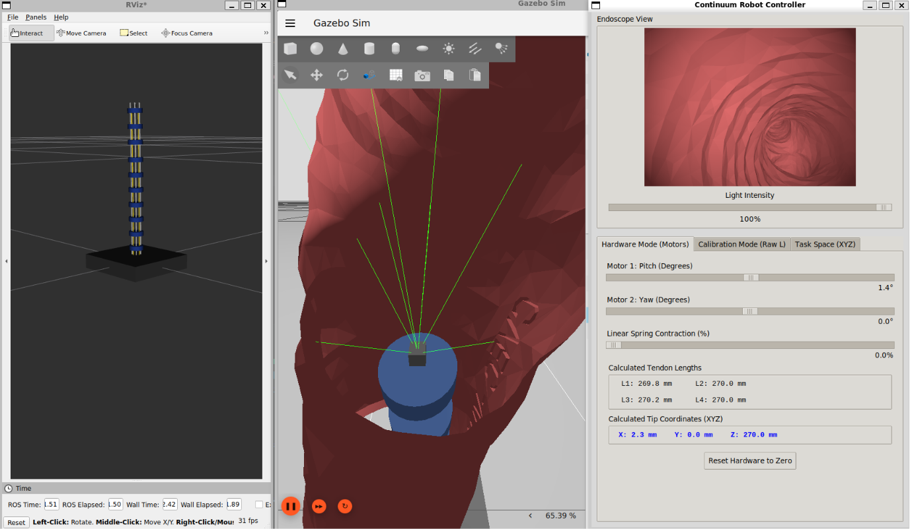
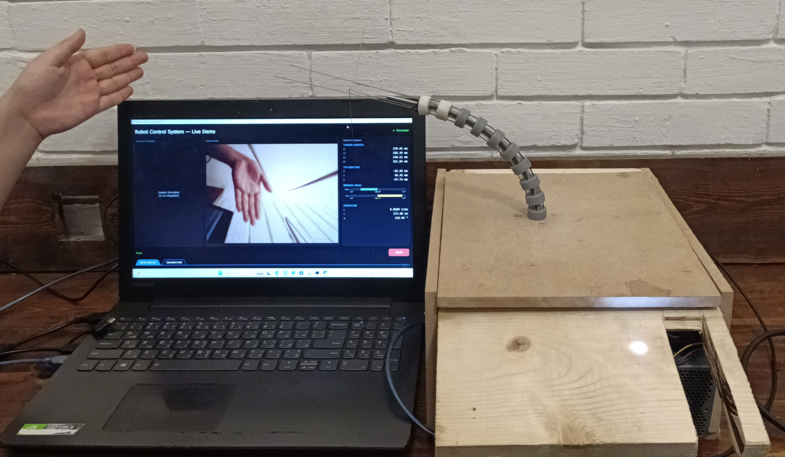
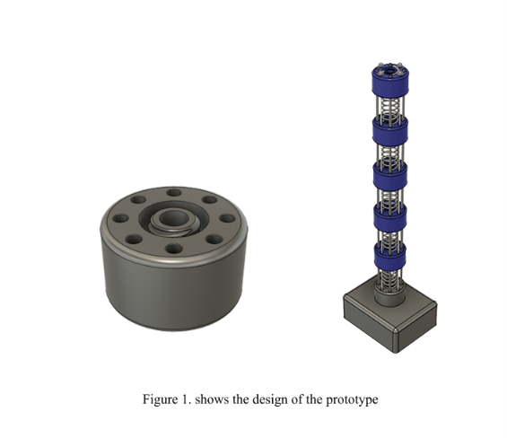

# Smart Endoscopic Autonomous System: One-Port Continuum Surgical Robot

[](https://docs.ros.org/en/jazzy/)
[](https://gazebosim.org/)
[](https://www.python.org/)

## Overview
This repository contains the software simulation, mathematical kinematics solver, and hardware control architecture for a one-port tendon-driven continuum surgical robot. Developed as a graduation project by Team Four from the Systems and Biomedical Engineering department at Cairo University, this cyber-physical system bridges a physical nitinol-core prototype with a highly accurate digital twin.

**Funding & Support:** This project was developed with support from ITIDA's ITAC funding program (2025–2026).

## Team Members
* **Ahmed Etman**
* **Ziad Mohamed**
* **Heidi Hussain**
* **Adham Khaled**

**Project Advisor:** Assistant Professor [Advisor Name]

# System Overview
<p align="center">
  
  
</p> 

---

## 🎥 Visual Demonstrations

*We built this system from the ground up, from the mechanical CAD design to the physical manufacturing and physics engine.*

### 1. Fusion 360 CAD Design

*The complete mechanical assembly designed in Autodesk Fusion 360, detailing the 10-disk backbone, exact 5.0 mm tendon routing channels, and the actuation base prior to physical manufacturing.*

### 2. The Physical Hardware Prototype

*Our physical 10-disk prototype bending. The system uses a super-elastic Nitinol core and compressive springs, actuated by NEMA-17 stepper motors.*

### 3. ROS 2 & Gazebo Digital Twin (Anatomical Navigation)

*Real-time simulation in Gazebo Harmonic, driven by our custom Inverse Kinematics solver. We imported 3D meshes of a human trachea and bronchial tree, allowing us to insert the robot and perform complex clinical maneuvers to mimic reality and validate collision dynamics.*

### 4. Interactive Operator Dashboard


*Our custom Tkinter GUI calculating discrete Constant Curvature tendon lengths (L1, L2, L3, L4) from Task-Space (XYZ) inputs.*

### 5. RViz 2 Holographic Tracking

*Real-time validation of the continuum spline and tendon routing (5mm radius) using TF2 coordinate transformations.*

---

## System Architecture

### 🛠️ Hardware (Physical Prototype)
Our team fully designed and manufactured the physical robot to validate our simulation math:
* **Backbone:** 10-Disk flexible structure with a super-elastic Nitinol core and stainless steel compressive springs.
* **Physical Dimensions:** Strictly 230.0 mm total resting length.
* **Endoscopic Vision:** A micro-camera is mounted directly at the distal tip of the continuum backbone to provide real-time visual feedback, replicating a true clinical endoscope.
* **Actuation:** 4-Tendon antagonistic routing system (exactly 5.0 mm routing radius) driven by high-precision NEMA-17 stepper motors.
* **Control Base:** Arduino-based microcontrollers handling low-level motor pulses, translating our Python solver's commands into physical tension.

### 💻 Software (Digital Twin & Control)
* **Anatomical Environment:** A full physics simulation in Gazebo Harmonic featuring realistic human trachea and bronchi meshes for environmental collision and maneuver testing.
* **Simulated Endoscopic Vision:** A virtual camera sensor is attached to the tip of the digital twin, streaming real-time video that perfectly matches the hardware's perspective during navigation.
* **Kinematics Solver:** A custom Python ROS 2 node implementing discrete Constant Curvature Inverse/Forward Kinematics to calculate exact tendon lengths and joint angles, preventing standard continuous-arc scaling errors.
* **Interactive Dashboard:** A GUI for real-time task-space (XYZ) and joint-space operator control.
* **Visualizer:** A custom node drawing the physical tendons and rods perfectly anchored to the base in RViz 2.

---

## Installation & Setup

### Prerequisites
* Ubuntu 24.04
* ROS 2 Jazzy
* Gazebo Harmonic

### Building the Workspace
We recommend performing a clean build of the package to prevent any caching issues with the URDF or custom Python nodes.

```bash
# 1. Create the workspace and clone the repository
mkdir -p ~/ros2_ws/src
cd ~/ros2_ws/src
git clone [https://github.com/Ahmed-Etman-111/tendon-driven-continuum-robot.git](https://github.com/Ahmed-Etman-111/tendon-driven-continuum-robot.git)

# 2. Navigate to the workspace root
cd ~/ros2_ws

# 3. Clean previous builds for this specific package
rm -rf build/tendon_continuum install/tendon_continuum

# 4. Build the package and source the overlay
colcon build --packages-select tendon_continuum
source install/setup.bash
```

---

## Launching the System
Once the workspace is built and sourced, launch the entire digital twin—including Gazebo, RViz 2, the custom TF broadcasters, and the Tkinter operator dashboard—with a single command:

```bash
ros2 launch tendon_continuum sim.launch.py
```

---

## Mathematical Foundation
Our Inverse Kinematics solver avoids standard rigid-link approximations in favor of exact discrete arc geometry based on established continuum robotics research. The tendon lengths ($L_1, L_2, L_3, L_4$) are calculated dynamically to account for the 10-disk physical configuration and the exact 5.0 mm routing offset, ensuring 1-to-1 parity between the digital commands and the physical hardware.
